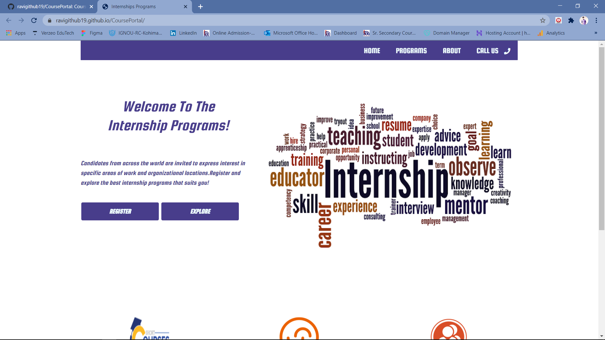
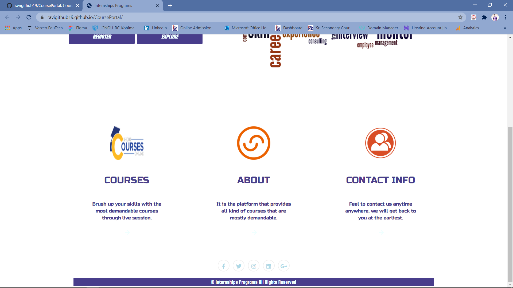
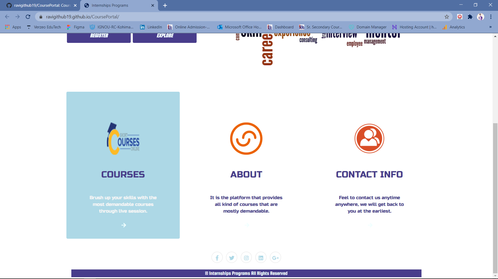
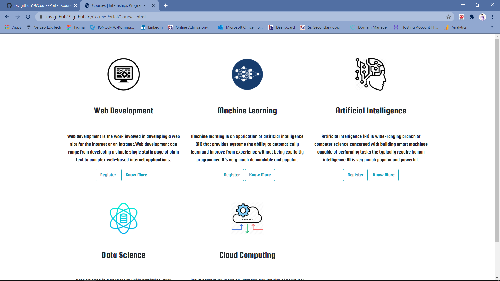
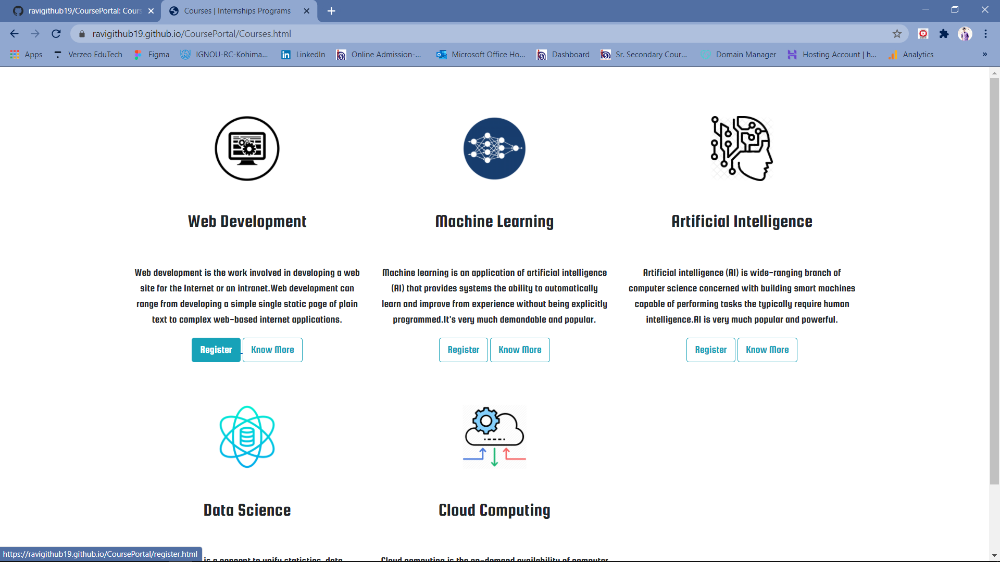
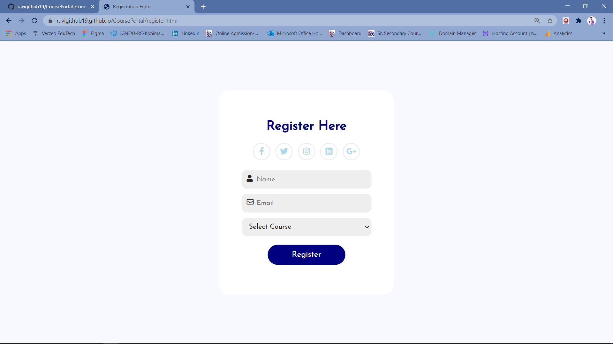

## View Live
> Course Portal - https://ravigithub19.github.io/CoursePortal/

## About
> Created an online course portal website for Desktop View

>Frontend :
>1. Home Page with Header, Footer, Main Register section where it will take to a registration page on clicking , 3 smaller sections (side by side) - courses (it will take to >courses page on clicking), about us, contact info.
>2. Clicking on courses will take to the courses page. I have mentioned 5 courses listed - with title, and a bit of description about the course. Two buttons alongside with option >to Register for a course, which takes the user to register page with course title pre-populated.
>3. Register page - form with Name, Email id, course title (a drop-down list to select from 5 courses available)

## Screenshots
 

 

 

 

 

 

## Technologies
* HTML5
* CSS3

## Status
> Completed
